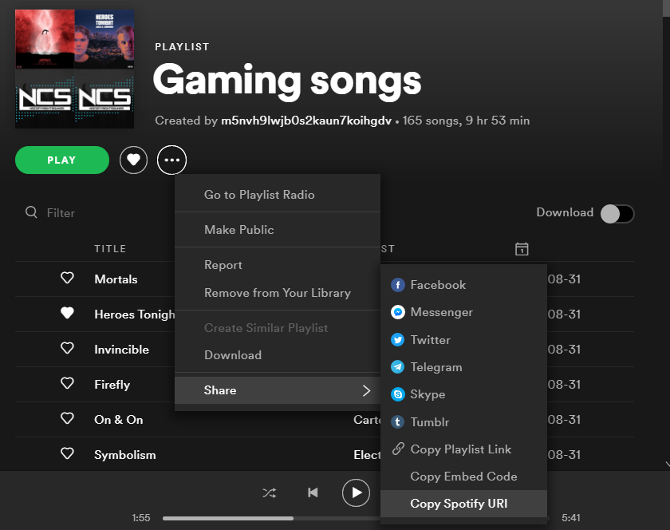

# Spotify Playlist Downloader

> - This will let you download Spotify playlists for free without Premium.
> - It gets all the songs from the API and downloads them from YouTube.

# Installation:
- Installing the Modules: 
  ```
    pip install -r requirements.txt
  ```
- Get your Spotify Client ID and Client Secret, save it as environment variables: `SPOTIFY_CLIENT_ID` `SPOTIFY_CLIENT_SECRET`.

- Follow the code comments to get an Idea.

# How to run:

- Run the `Main.py` file.
- Copy the Spotify Playlist URI/URL or Embed Code

- Paste it.
- Give a name to the Playlist.
- It will Start Downloading.
>(Recommended): 
 It will also ask whether to convert the audio to mp3 or not, Type Y for yes

---
Read my blog: https://notyasho.netlify.app/blogs
[Contact](https://notyasho.netlify.app/contact)
